# React Native Animations Showcase

This repo contains a React Native project with animations challenges and examples using the new Reanimated 2 API

[Check Reanimated 2 documentation here.](https://docs.swmansion.com/react-native-reanimated/)

## Challenges

- [Reanimated 2 Example](#reanimated-2-example)
- [Drag And Drop](#drag-and-drop)
- [Toggl](#toggl)
- [Reflectly Color Selection](#reflectly-color-selection)
- [Onboarding Challenge](#onboarding-challenge)
- [Shared element transition](#shared-element-transition)
- [Accordion](#accordion)
- [Custom Tab Bar](#custom-tab-bar)
- [Skate Challenge](#skate-challenge)
- [Spotify Player UI](#spotify-player-ui)
- [Sticky Shapes](#sticky-shapes)
- [Chanel Scroll](#chanel-scroll)
- [Rainbow Charts](#rainbow-charts)
- [Bouncing Ball](#bouncing-ball)
- [Paper Switch](#paper-switch)

## Reanimated 2 Example

First example that comes with the library itself
  

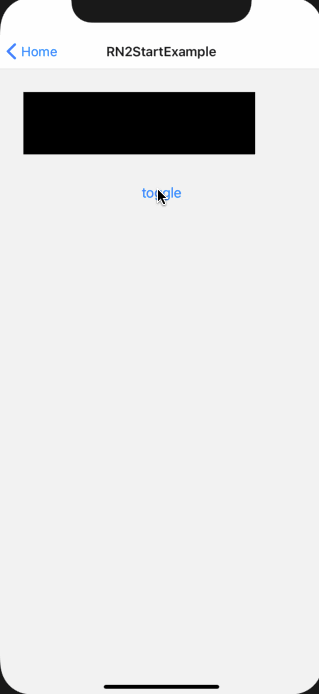
  

## Drag and Drop

Simple drag and drop
  

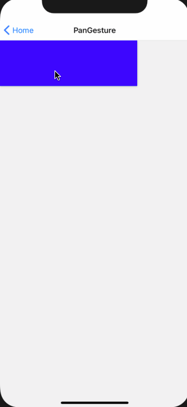
  

## Toggl

Toggl Tracker inspiration
  

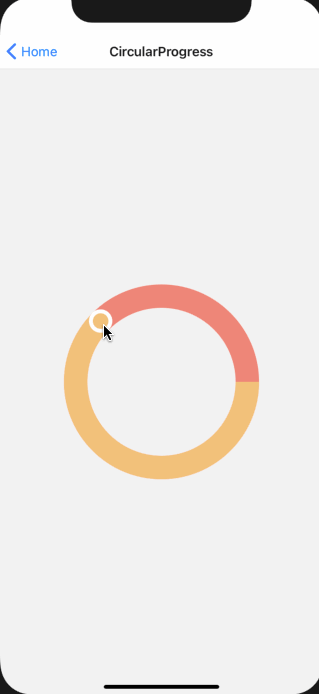
  

## Reflectly Color Selection

Reflectly challenge guided by William Candillon in `Can It Be Done in React Native` Season 4
[Reflectly Color Selection](https://www.youtube.com/watch?v=52luoBZC0Uw&t=3201s)
  

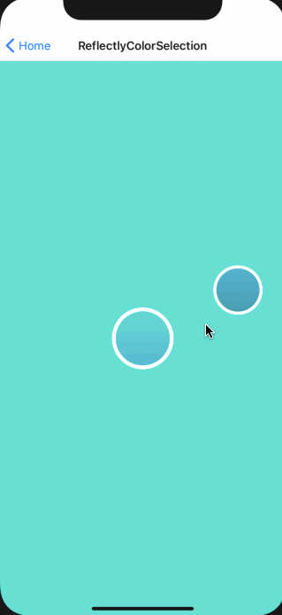
  

## Onboarding Challenge

Custom onboarding slides challenge
  

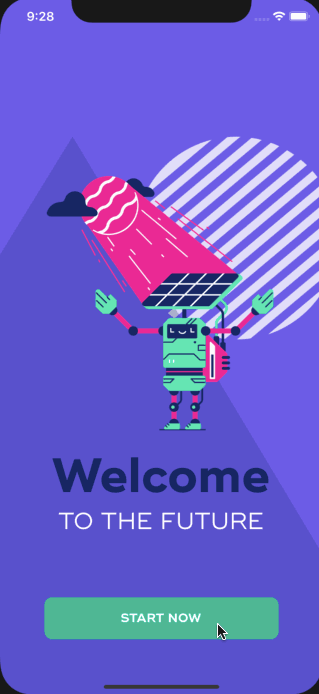
  

## Shared element transition

Shared element transition guided by William Candillon
[React Native shared element transition](https://www.youtube.com/watch?v=iejTIn9zi0U&t=102s)
  

  

## Accordion

Simple accordion list
  

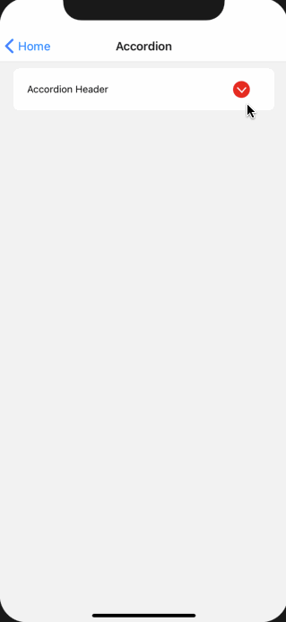
  

## Custom Tab Bar

Custom tab bar challenge from Dribbble
[Tab Bar Switches Interaction](https://dribbble.com/shots/14028381-Tab-Bar-Switches-Interaction)
  

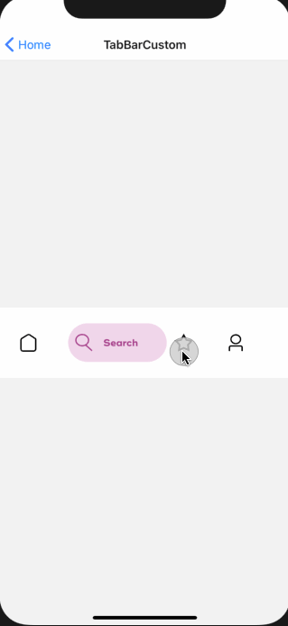
  

## Skate Challenge

Skate UI challenge from Dribbble
[Skate Challenge](https://dribbble.com/shots/6779026-One-Hour-UI-Challenge-34-Skate-shop)
  

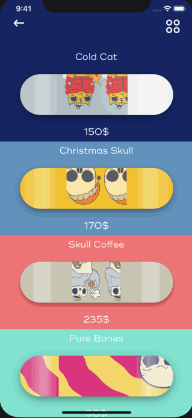
  

## Spotify Player UI

Spotify player UI challenge
  

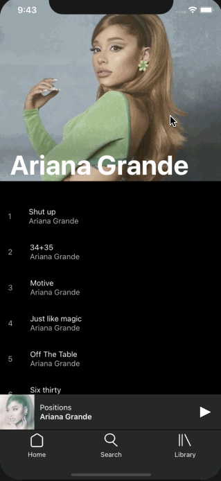
  

## Sticky Shapes

Sticky shapes guided by William Candillon
[Sticky shapes](https://www.youtube.com/watch?v=7j4Av7rfl9k&t=5s)
  

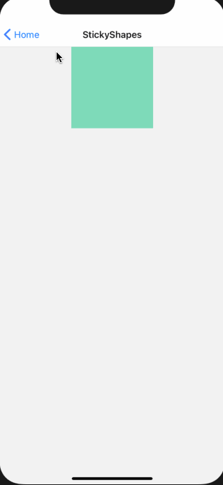
  

## Chanel Scroll

Chanel Scroll guided by William Candillon in in `Can It Be Done in React Native` Season 4
[Chanel Scroll](https://www.youtube.com/watch?v=ucpoqa2-74s)
  

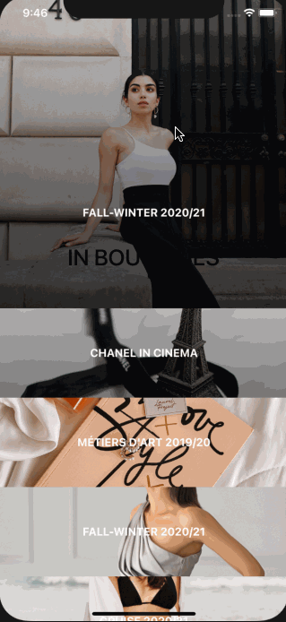
  

## Rainbow Charts

Rainbow Charts guided by William Candillon in in `Can It Be Done in React Native` Season 4
[Rainbow Charts](https://www.youtube.com/watch?v=ucpoqa2-74s)
  

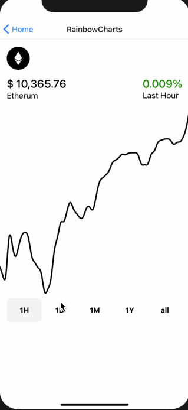
  

## Bouncing Ball

Continuous animation of a ball in a soccer field
  

  

## Paper Switch

Inspiration from Ramotion and his Paper Switch for SwiftUI
  

  

## Acknowledgements

- [@wcandillon](https://github.com/wcandillon) for `react-native-redash` and all of your amazing videos and courses.
- [@ramotion](https://github.com/Ramotion)
